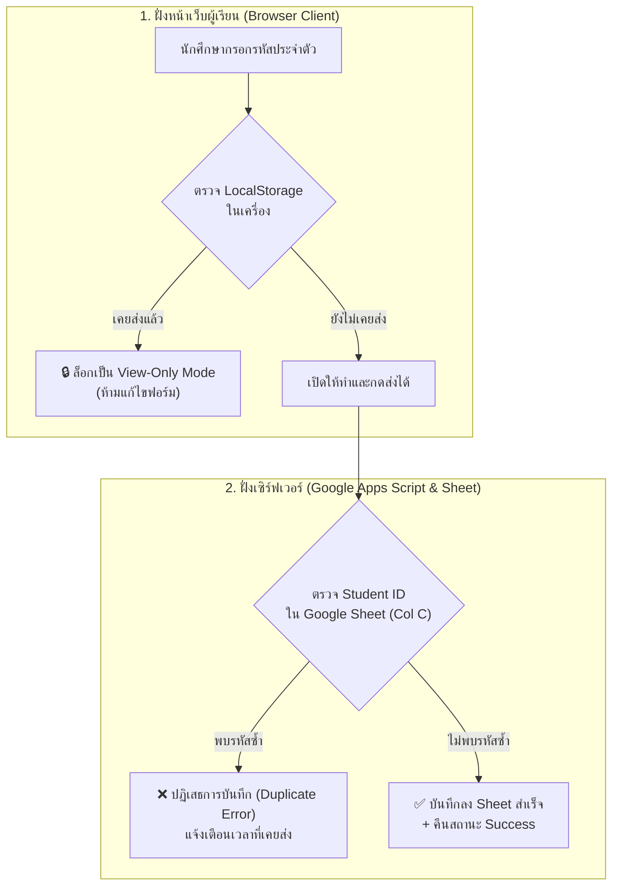

# คู่มือการบริหารจัดการระบบส่งงานและการปลดล็อกให้นักศึกษาส่งงานใหม่
## (Teacher Administration & Student Resubmission Manual)

เอกสารนี้จัดทำขึ้นสำหรับอาจารย์ผู้สอนและผู้ดูแลระบบ เพื่อใช้เป็นแนวทางในการจัดการสิทธิ์การส่งใบงานปฏิบัติการ การตรวจสอบความถูกต้อง และขั้นตอนการปลดล็อกให้นักศึกษาสามารถส่งงานใหม่ (Resubmission) ในกรณีที่มีเหตุจำเป็น

---

## 🧭 สถาปัตยกรรมการควบคุมการส่งงาน (One-Time Submission Architecture)

ระบบใบงานปฏิบัติการได้ติดตั้งระบบป้องกันการส่งงานซ้ำแบบ **2 ระดับ (Two-Layer Enforcement)** เพื่อความโปร่งใสและเป็นมาตรฐานเดียวกัน:



---

## 👨‍🏫 ขั้นตอนการปลดล็อกสำหรับอาจารย์ผู้สอน (Teacher Steps)

เมื่ออาจารย์พิจารณาอนุญาตให้นักศึกษาคนใดคนหนึ่งส่งงานใหม่ได้ อาจารย์สามารถดำเนินการปลดล็อกที่ **Google Sheets** ของแล็บนั้นๆ ได้ตาม 2 วิธีดังนี้:

### วิธีที่ 1: ลบแถวข้อมูลเดิมออก (แนะนำสำหรับกรณีส่งผิด / ส่งใหม่โดยสิ้นเชิง)
1. เปิดไฟล์ **Google Sheets** ที่เชื่อมต่อกับใบงานนั้นๆ (เช่น แผ่นงาน `Lab C 1 Submissions`, `Lab C Flowchart Submissions` ฯลฯ)
2. กด `Ctrl + F` (หรือ `Cmd + F`) เพื่อค้นหา **รหัสนักศึกษา** ที่ต้องการปลดล็อก
3. คลิกขวาที่ **หมายเลขแถว (Row Number)** ด้านซ้ายสุด
4. เลือกเมนู **"ลบแถว (Delete row)"**
5. ✅ **ผลลัพธ์:** รหัสนักศึกษาจะถูกปลดล็อกที่ฝั่งเซิร์ฟเวอร์ทันที นักศึกษาสามารถส่งใหม่ได้ทันทีโดยไม่ต้อง Deploy ระบบใหม่

---

### วิธีที่ 2: เปลี่ยนชื่อรหัสเดิมเพื่อเก็บประวัติ (Archive & Resubmit)
*หากอาจารย์ต้องการเก็บข้อมูลหรือไฟล์แนบของการส่งรอบแรกไว้เป็นหลักฐานเปรียบเทียบ:*
1. ค้นหาแถวของนักศึกษาคนดังกล่าวใน Google Sheet
2. ไปที่ **คอลัมน์ C (รหัสนักศึกษา)**
3. ทำการแก้ไขรหัสนักศึกษาโดยเติมคำกำกับ เช่น:
   * จาก `65010999` $\rightarrow$ แก้เป็น `65010999_รอบ1` หรือ `65010999_old`
4. ✅ **ผลลัพธ์:** ข้อมูลเดิมยังคงอยู่ครบถ้วน แต่รหัสจริง `65010999` จะว่างลง ทำให้ระบบเปิดรับการส่งรอบใหม่ของรหัสนี้ได้ทันที

---

## 🧑‍🎓 ขั้นตอนสำหรับนักศึกษาเพื่อเปิดส่งใหม่ (Student Steps)

หลังจากอาจารย์ปลดล็อกที่ Google Sheet เรียบร้อยแล้ว นักศึกษาต้องดำเนินการปลดล็อกหน้าเว็บเบราว์เซอร์ของตนเอง โดยเลือกวิธีใดวิธีหนึ่งดังนี้:

### วิธีที่ 1: เปิดใน "หน้าต่างไม่ระบุตัวตน" (เร็วและง่ายที่สุด ⭐ แนะนำ)
1. ให้นักศึกษาเปิดเบราว์เซอร์ (Google Chrome, Edge, Safari ฯลฯ)
2. กดเปิด **"หน้าต่างไม่ระบุตัวตน (Incognito Window / InPrivate Window)"**
   * *คีย์ลัด:* `Ctrl + Shift + N` (Windows) หรือ `Cmd + Shift + N` (Mac)
3. วางลิงก์ใบงานปฏิบัติการ แล้วเปิดหน้าเว็บ
4. ✅ หน้าเว็บจะเปิดเป็นฟอร์มว่าง พร้อมให้ทำใบงาน ตรวจสอบคะแนน และกดยืนยันส่งงานรอบใหม่ได้ทันที

---

### วิธีที่ 2: ล้างแคชหน้าเว็บ (Clear Site Storage)
*หากนักศึกษาต้องการใช้งานบนแท็บเบราว์เซอร์ปกติเดิม:*
1. บนหน้าเว็บใบงาน ให้กดปุ่ม **`F12`** (หรือคลิกขวาที่ว่าง แล้วเลือก *ตรวจสอบ / Inspect*)
2. ไปที่แท็บ **`Application`** (หากมองไม่เห็น ให้คลิกที่เครื่องหมาย `>>`)
3. ที่เมนูด้านซ้าย เลือกหัวข้อ **`Storage`** หรือ **`Local Storage`**
4. คลิกปุ่ม **`Clear site data`** (หรือคลิกขวาที่ URL ใต้ Local Storage แล้วเลือก *Clear*)
5. กด **`F5`** เพื่อรีเฟรชหน้าเว็บ 1 ครั้ง
6. ✅ ฟอร์มจะปลดล็อกออกจากโหมด View-Only และสามารถกรอกส่งใหม่ได้ทันที

---

## ❓ คำถามที่พบบ่อยและกรณีศึกษา (FAQs & Troubleshooting)

### Q1: นักศึกษาบอกว่า "ส่งไฟล์รูปผิด" หรือ "ลืมแนบไฟล์โค้ด" แล้วกดยืนยันไปแล้ว
* **แนวทางแก้ไข:** 
  1. อาจารย์เข้าไปที่ Google Sheet ของแล็บนั้น ลบแถวของนักศึกษาออก (หรือเติม `_old`)
  2. แจ้งให้นักศึกษาเปิดลิงก์ใบงานใน **Incognito Window** แล้วแนบไฟล์ที่ถูกต้องพร้อมกดยืนยันส่งใหม่อีกครั้ง

---

### Q2: นักศึกษาแจ้งว่า "ขึ้นหน้าต่างสีแดงเตือนว่าไม่อนุญาตให้ส่งซ้ำ" เกิดจากอะไร?
* **สาเหตุ:** เกิดจาก 2 กรณี:
  1. เบราว์เซอร์จำสถานะการส่งเดิมไว้ในเครื่อง (แก้โดยเปิด Incognito)
  2. รหัสนักศึกษานั้นยังมีแถวบันทึกอยู่ใน Google Sheet (แก้โดยอาจารย์ลบแถวนั้นใน Sheet)

---

### Q3: จำเป็นต้องเข้าไป Deploy New Version ใน Google Apps Script หรือไม่เมื่อปลดล็อก?
* **ตอบ:** **ไม่ต้องเลยครับ!** โค้ดใน `Code.gs` ทำการตรวจสอบฐานข้อมูลใน Google Sheet แบบ Real-time ทุกครั้งที่มีการกดยืนยันส่ง เพียงแค่อาจารย์แก้ไข/ลบแถวใน Sheet ระบบก็จะอัปเดตการอนุญาตทันทีโดยอัตโนมัติ

---

## 📋 เช็คลิสต์สรุปขั้นตอน (Quick Summary Checklist)

```
[ ] 1. อาจารย์เปิด Google Sheet ประจำแล็บ
[ ] 2. ค้นหารหัสนักศึกษา (Ctrl+F) ในคอลัมน์ C
[ ] 3. ลบแถวนั้นออก (Delete Row) หรือเติม _old ต่อท้ายรหัส
[ ] 4. แจ้งนักศึกษาเปิดลิงก์ใน "หน้าต่างไม่ระบุตัวตน (Incognito)"
[ ] 5. นักศึกษาทำใบงาน ตรวจสอบคะแนน และกดยืนยันส่งใหม่สำเร็จ!
```
