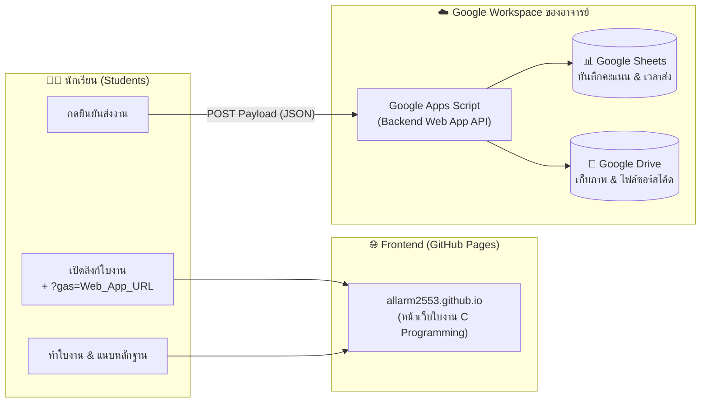

# คู่มือการเชื่อมต่อ Google Sheets และการส่งลิงก์ใบงานให้นักเรียน
## (Teacher Setup & Link Sharing Manual with Google Apps Script)

เอกสารนี้จัดทำขึ้นสำหรับ **อาจารย์ผู้สอน** เพื่ออธิบายขั้นตอนการติดตั้งระบบรับคะแนนผ่าน **Google Apps Script (GAS)**, การเชื่อมโยงเข้ากับ **Google Sheets**, และวิธีการส่งลิงก์ใบงานปฏิบัติการให้นักเรียน เพื่อให้คะแนนและไฟล์หลักฐานส่งตรงเข้า Google Sheets ของอาจารย์แต่ละท่านอย่างถูกต้อง แม่นยำ และปลอดภัย

---

## 🧭 สถาปัตยกรรมการทำงานของระบบ (Architecture)



---

## 🚀 ขั้นตอนที่ 1: การสร้างและ Deploy Google Apps Script (ทำ 1 ครั้งต่อ 1 แล็บ)

1. **สร้าง Google Sheet:**
   - ไปที่ [sheets.google.com](https://sheets.google.com) สร้าง Spreadsheet เปล่าขึ้นมา 1 ไฟล์ (เช่น ตั้งชื่อว่า *ตารางคะแนนแล็บภาษา C*)
2. **เปิด Apps Script:**
   - ที่แถบเมนูด้านบน คลิก **ส่วนขยาย (Extensions)** $\rightarrow$ **Apps Script**
3. **คัดลอกโค้ด Backend:**
   - ในหน้าต่างโค้ด ให้ลบโค้ดเดิมใน `Code.gs` ออกทั้งหมด
   - คัดลอกโค้ดจากไฟล์ `Code.gs` ในโฟลเดอร์ของแล็บนั้นๆ (เช่น [lab-flowchart/Code.gs](file:///Users/allarmmac/myjob_folder/MyLaB/Cprogramming/lab-flowchart/Code.gs) หรือ `lab1/Code.gs`) มาวางลงไป
   - กดบันทึก 💾 (`Ctrl + S` หรือ `Cmd + S`)
4. **ทำการ Deploy เป็น Web App:**
   - คลิกปุ่ม **การใช้งานที่ใช้งานได้จริง (Deploy)** สีน้ำเงินที่มุมขวาบน $\rightarrow$ เลือก **การจัดการการใช้งานที่ใช้งานได้จริงใหม่ (New deployment)**
   - คลิกรูปเฟือง ⚙️ ข้าง "เลือกประเภท" $\rightarrow$ เลือก **เว็บแอป (Web app)**
   - ตั้งค่าดังนี้:
     - **คำอธิบาย (Description):** ตั้งชื่อ เช่น *Lab Flowchart Submission API*
     - **เรียกใช้งานในฐานะ (Execute as):** เลือก **ฉัน (Me / บัญชีอีเมลของคุณ)**
     - **ผู้มีสิทธิ์เข้าถึง (Who has access):** เลือก **ทุกคน (Anyone)** *(สำคัญมาก เพื่อให้นักเรียนส่งข้อมูลเข้าได้โดยไม่ต้องล็อกอินบัญชีองค์กรเดียวกัน)*
   - คลิก **การใช้งานที่ใช้งานได้จริง (Deploy)**
   - คลิก **อนุมัติสิทธิ์การเข้าถึง (Authorize access)** $\rightarrow$ เลือกอีเมล Google ของท่าน $\rightarrow$ คลิก **ขั้นสูง (Advanced)** $\rightarrow$ คลิก **ไปที่... (ไม่ปลอดภัย) / Go to ... (unsafe)** $\rightarrow$ คลิก **อนุญาต (Allow)**
5. **คัดลอก Web App URL:**
   - จะได้ URL ในรูปแบบ:
     `https://script.google.com/macros/s/AKfycb.../exec`
   - คัดลอกลิงก์นี้ไว้เพื่อนำไปใช้งานในขั้นตอนถัดไป

---

## 🔗 ขั้นตอนที่ 2: วิธีการส่งลิงก์ใบงานให้นักเรียน (เลือกได้ 3 รูปแบบ)

---

### ⭐ วิธีที่ 1: แนบลิงก์ผ่าน URL Parameter `?gas=...` (สะดวกที่สุด & แนะนำสำหรับอาจารย์ทุกคน)

วิธีนี้เหมาะอย่างยิ่งเมื่อมี **อาจารย์หลายท่าน** ใช้งานหน้าเว็บเดียวกัน หรือนำลิงก์ไปสอนต่างห้อง/ต่างวิทยาลัย คะแนนของนักเรียนจะแยกเข้า Google Sheets ของอาจารย์แต่ละท่านอย่างอิสระ 100%

#### วิธีทำง่ายๆ ผ่านหน้าเว็บ:
1. เปิดหน้าใบงานที่ต้องการ เช่น:
   `https://allarm2553.github.io/lab-c-programming/lab-flowchart/`
2. ที่กล่องด้านบน **"เชื่อมต่อ Google Sheets ผู้สอน (Teacher Web App URL)"**:
   - วาง Web App URL ที่ได้จากขั้นตอนที่ 1
   - กดปุ่ม **"💾 บันทึก URL"**
   - กดปุ่ม **"📋 คัดลอกลิงก์ให้นักเรียน"**
3. ระบบจะคัดลอกลิงก์ที่ต่อท้าย `?gas=...` ให้ทันที เช่น:
   ```text
   https://allarm2553.github.io/lab-c-programming/lab-flowchart/?gas=https://script.google.com/macros/s/AKfycb.../exec
   ```
4. **นำลิงก์นี้ไปส่งให้นักเรียน:** ส่งผ่าน LINE Group, Google Classroom, Facebook Group หรือสร้าง QR Code ให้นักเรียนสแกน

> [!TIP]
> **เมื่อนักเรียนคลิกลิงก์นี้:**
> - หน้าเว็บของนักเรียนจะขึ้นแถบสถานะสีเขียว **"เชื่อมต่อ Google Sheets แล้ว (Online Mode)"** โดยอัตโนมัติ
> - นักเรียนไม่ต้องกรอกหรือตั้งค่าลิงก์ใดๆ เลย แค่ทำใบงานและกดส่ง คะแนนจะวิ่งตรงเข้า Sheet ของอาจารย์ทันที!

---

### วิธีที่ 2: บันทึกลงเบราว์เซอร์เครื่องผู้สอนผ่านเมนู "ลิงก์ส่งคะแนน (14 Labs)"

เหมาะสำหรับการเปิดทดสอบบนเครื่องของอาจารย์ หรือติดตั้งไว้บนเครื่องคอมพิวเตอร์ในห้องปฏิบัติการ:

1. เปิดหน้าแรกของเว็บไซต์:
   `https://allarm2553.github.io/lab-c-programming/`
2. คลิกปุ่ม **"🔗 ลิงก์ส่งคะแนน (14 Labs)"** ที่ Navbar ด้านบน
3. วาง Web App URL ของแต่ละแล็บที่ต้องการ
4. กดปุ่ม **"💾 บันทึกลงเบราว์เซอร์"**
5. เบราว์เซอร์ในเครื่องนั้นจะจำค่า URL ไว้ และส่งคะแนนเข้าชีตตามที่ระบุ

---

### วิธีที่ 3: ฝังลิงก์ในไฟล์ `config.js` บน GitHub (สำหรับเจ้าของ Repo)

เหมาะสำหรับอาจารย์ผู้พัฒนาที่เป็น **เจ้าของ GitHub Repository**:

1. เปิดไฟล์ `config.js` ในโปรเจกต์
2. นำ Web App URL ไปใส่ในตัวแปร `LAB_CONFIG` ตามรหัสแล็บ เช่น:
   ```javascript
   const LAB_CONFIG = {
     "lab-flowchart": "https://script.google.com/macros/s/AKfycb.../exec",
     "lab-basic": "https://script.google.com/macros/s/AKfycb.../exec",
     ...
   };
   ```
3. Commit และ Push ขึ้น GitHub (`main` branch)
4. เมื่ออัปเดตแล้ว นักเรียนทุกคนที่เปิดลิงก์ปกติ (ไม่จำเป็นต้องมี `?gas=`) จะส่งคะแนนเข้า Google Sheets ของอาจารย์เจ้าของ Repo ทันที

---

## 📋 ขั้นตอนที่ 3: การตรวจงานและดูคะแนนนักเรียน (Teacher Grader Portal)

อาจารย์สามารถตรวจคะแนน ดูหลักฐานภาพถ่าย และดาวน์โหลดโค้ดนักเรียนได้อย่างสะดวกรวดเร็วผ่าน **หน้าตรวจงานในตัว (Auto-Grader)**:

1. นำ Web App URL ของอาจารย์มาเติม `?page=grader` ต่อท้าย เช่น:
   ```text
   https://script.google.com/macros/s/AKfycb.../exec?page=grader
   ```
   *(หรือกดปุ่ม **"⚡ ทดสอบเชื่อมต่อ"** บนหน้าใบงาน)*
2. หน้าตรวจงานจะแสดงรายชื่อนักศึกษาทุกคนที่ส่งงาน คะแนนรวม คะแนนรายข้อ และปุ่มดูภาพถ่ายหน้าจอกับไฟล์โค้ด
3. อาจารย์สามารถกดปุ่ม **"ส่งออกเป็น Excel / CSV"** หรือจัดการข้อมูลได้โดยตรงจาก Google Sheets

---

## ❓ คำถามที่พบบ่อย (FAQs)

### Q1: ถ้าอาจารย์ท่านอื่นนำ URL ใบงานไปแชร์ต่อนักเรียน ข้อมูลจะชนกันไหม?
- **ไม่ชนกันครับ** หากใช้วิธีแนบพารามิเตอร์ `?gas=...` เพราะระบบจะส่งข้อมูลไปยังชีตตาม URL ที่แนบไปในแต่ละลิงก์อย่างชัดเจน

### Q2: นักศึกษาแจ้งว่าหน้าเว็บขึ้น "Local Preview Mode (โหมดทดสอบออฟไลน์)"
- **สาเหตุ:** นักศึกษาเปิดลิงก์แบบธรรมดาที่ไม่มี `?gas=` ต่อท้าย และใน `config.js` ยังไม่ได้ระบุ URL
- **วิธีแก้ไข:** ให้อาจารย์ส่งลิงก์แบบมี `?gas=Web_App_URL` ให้นักศึกษาเปิดใหม่อีกครั้ง

### Q3: นักศึกษากรอกข้อมูลผิด หรือต้องการส่งงานใหม่ อาจารย์ต้องทำอย่างไร?
- ให้อาจารย์ปฏิบัติตาม **[คู่มือการบริหารจัดการระบบส่งงานและการปลดล็อก (TEACHER_ADMIN_MANUAL.md)](file:///Users/allarmmac/myjob_folder/MyLaB/Cprogramming/TEACHER_ADMIN_MANUAL.md)** โดยการลบแถวของนักศึกษาใน Google Sheet แล้วให้นักศึกษาเปิดทำใหม่ใน *Incognito Window*
